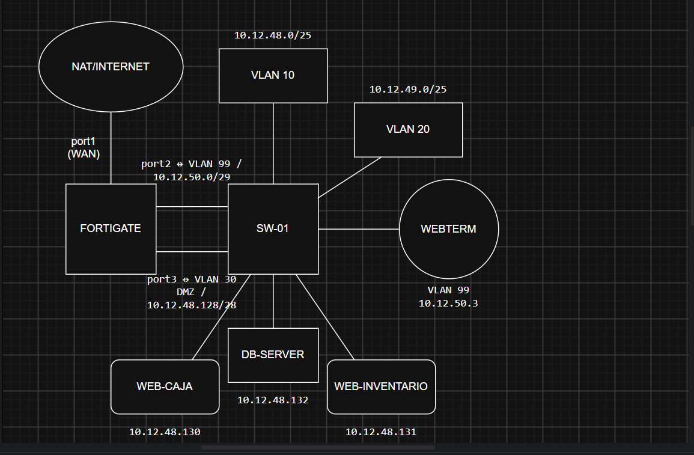

# FortiGate DMZ - Seguridad de Redes

## 🎥 Video demostrativo

**Video:** [Agregar enlace de YouTube o OneDrive]

En el video se muestra el funcionamiento general de la topología y las principales pruebas realizadas para comprobar que las políticas de seguridad están funcionando correctamente.

---
## Diagrama lógico

## 📌 Propósito del laboratorio

El objetivo de esta práctica fue crear una infraestructura de red segmentada y segura utilizando FortiGate, VLAN, una zona DMZ y diferentes políticas de acceso.

La idea principal fue separar correctamente la red de usuarios de la red de servidores y controlar qué tipo de comunicación puede existir entre ellas.

También se buscó evitar que los servidores ubicados en la DMZ pudieran comunicarse libremente con la red interna o con Internet. En lugar de darles acceso completo, solo se permitió la comunicación necesaria para las actualizaciones del sistema.

Además, se aplicaron configuraciones básicas de seguridad en el switch para proteger los puertos utilizados por los usuarios y deshabilitar aquellos que no forman parte de la topología.

---

## 🖥️ Topología

La infraestructura utilizada está compuesta por:

- 1 FortiGate
- 1 switch Cisco
- 2 usuarios
- 2 servidores Web
- 1 servidor de Base de Datos
- 1 WebTerm utilizado para la administración
- 1 conexión NAT para representar la salida hacia Internet

Los servidores utilizados fueron:

- **WEB-CAJA**
- **WEB-INVENTARIO**
- **DB-SERVER**

Los usuarios se encuentran separados en:

- **PC1:** VLAN 10
- **PC2:** VLAN 20

El diagrama de la topología se encuentra a continuación:

---

## 🌐 Direccionamiento IP

Para mantener la red organizada, se utilizaron diferentes segmentos para usuarios, servidores y administración.

### VLAN 10

Red utilizada por el primer grupo de usuarios.

- Red: `10.12.48.0/25`
- Gateway: `10.12.48.1`
- Asignación de IP: DHCP

### VLAN 20

Esta VLAN corresponde al grupo autorizado para utilizar SSH hacia los servidores.

- Red: `10.12.49.0/25`
- Gateway: `10.12.49.1`
- Asignación de IP: DHCP

### DMZ

Los tres servidores fueron ubicados dentro de una red independiente configurada como DMZ.

- Red: `10.12.48.128/28`
- Gateway: `10.12.48.129`

| Equipo | Dirección IP |
|---|---|
| FortiGate - DMZ | `10.12.48.129` |
| WEB-CAJA | `10.12.48.130` |
| WEB-INVENTARIO | `10.12.48.131` |
| DB-SERVER | `10.12.48.132` |

### Red de administración

También se utilizó una pequeña red de tránsito y administración entre el switch, FortiGate y WebTerm.

- Red: `10.12.50.0/29`
- FortiGate: `10.12.50.1`
- Switch Cisco: `10.12.50.2`
- WebTerm: `10.12.50.3`

---

## 🔥 Configuración del FortiGate

El FortiGate se utilizó como el dispositivo principal de seguridad entre la red interna, la DMZ e Internet.

Las configuraciones y demostraciones fueron realizadas desde la interfaz gráfica del equipo.

Las interfaces principales quedaron organizadas de la siguiente forma:

| Interfaz | Función |
|---|---|
| port1 | Salida hacia Internet |
| port2 | Comunicación con la red interna |
| port3 | Red DMZ |

Debido a que las VLAN de usuarios se encuentran detrás del switch Cisco, también fue necesario crear rutas estáticas para que FortiGate pudiera regresar correctamente el tráfico hacia ellas.

Las rutas utilizadas fueron:

- `10.12.48.0/25` vía `10.12.50.2`
- `10.12.49.0/25` vía `10.12.50.2`

---

## 🛡️ Políticas de seguridad

Uno de los puntos principales de esta práctica fue controlar el acceso hacia los servidores dependiendo de la VLAN de origen.

### Acceso SSH desde VLAN 20

La VLAN 20 fue configurada como la única red autorizada para acceder por SSH a los servidores.

El servicio permitido es:

- TCP 22 / SSH

Se realizaron pruebas hacia:

- WEB-CAJA
- WEB-INVENTARIO
- DB-SERVER

Desde VLAN 20 las conexiones fueron permitidas correctamente.

Al intentar realizar las mismas pruebas desde VLAN 10, las conexiones quedaron bloqueadas.

---

## 🌐 Acceso de VLAN 10 al Sistema de Caja

Los usuarios pertenecientes a VLAN 10 tienen acceso al servidor WEB-CAJA utilizando servicios Web.

Servidor:

`10.12.48.130`

Servicios permitidos:

- HTTP
- HTTPS

Durante las pruebas se confirmó que el puerto HTTP se encuentra accesible desde PC1.

---

## 🚫 Restricción de VLAN 10 al Sistema de Inventario

Uno de los requisitos principales era impedir que VLAN 10 pudiera acceder al Sistema de Inventario.

El servidor utilizado para este sistema es:

`10.12.48.131`

Al intentar acceder desde PC1 al puerto HTTP del servidor, la conexión no fue permitida.

De esta forma se comprobó que VLAN 10 puede acceder al Sistema de Caja, pero no al Sistema de Inventario.

---

## 🌐 Acceso a Internet desde la DMZ

Los servidores ubicados en la DMZ no tienen acceso libre hacia Internet.

Para las actualizaciones del sistema solo se permitieron los siguientes destinos:

- `archive.ubuntu.com`
- `security.ubuntu.com`

Gracias a esta configuración, los servidores pueden ejecutar correctamente:

`apt update`

Sin embargo, cuando se intenta realizar una conexión hacia un destino externo que no está autorizado, el tráfico queda bloqueado.

Como prueba adicional se realizó una conexión HTTP hacia un destino diferente a los repositorios autorizados y el resultado fue:

`BLOQUEADO`

Esto permite comprobar que la DMZ no tiene una salida abierta hacia Internet.

---

## 🔒 Aislamiento de la DMZ

También se verificó que los servidores ubicados en la DMZ no puedan iniciar conexiones hacia las redes internas de usuarios.

Se realizaron pruebas desde WEB-CAJA y DB-SERVER hacia los gateways de ambas VLAN:

- VLAN 10: `10.12.48.1`
- VLAN 20: `10.12.49.1`

En ambos casos se obtuvo:

`100% packet loss`

Esto confirma que los servidores de la DMZ no pueden iniciar tráfico hacia la LAN.

---

## 🌐 Servidores Web

### WEB-CAJA

El servidor WEB-CAJA utiliza Nginx para publicar el Sistema de Caja.

- IP: `10.12.48.130`
- Servicio: Nginx
- Puerto: TCP 80
- Función: Sistema de Caja

Se creó una página básica para identificar fácilmente el servicio durante las pruebas.

### WEB-INVENTARIO

El servidor WEB-INVENTARIO también utiliza Nginx.

- IP: `10.12.48.131`
- Servicio: Nginx
- Puerto: TCP 80
- Función: Sistema de Inventario

Este servidor se encuentra restringido para los usuarios pertenecientes a VLAN 10.

---

## 🗄️ Servidor de Base de Datos

El servidor DB-SERVER utiliza MariaDB.

- IP: `10.12.48.132`
- Puerto: TCP 3306
- Servicio: MariaDB

MariaDB fue configurado para escuchar directamente en:

`10.12.48.132:3306`

Esto permite que el servicio esté disponible dentro de la red de servidores sin dejarlo limitado únicamente a localhost.

---

## 🔐 Servicio SSH

OpenSSH fue instalado y habilitado en los tres servidores.

Las pruebas realizadas desde VLAN 20 confirmaron acceso al puerto TCP 22 de:

- WEB-CAJA
- WEB-INVENTARIO
- DB-SERVER

Las mismas pruebas realizadas desde VLAN 10 terminaron en timeout.

Esto demuestra que VLAN 20 es la única red de usuarios autorizada para acceder por SSH a los servidores.

---

## 🔀 Configuración del Switch

El switch Cisco se utilizó para separar los equipos mediante VLAN y también para realizar el enrutamiento de las redes de usuarios.

Las VLAN configuradas fueron:

| VLAN | Nombre | Uso |
|---|---|---|
| 10 | USUARIOS_VLAN10 | Usuarios |
| 20 | USUARIOS_VLAN20 | Usuarios con acceso SSH |
| 30 | DMZ_SERVIDORES | Servidores |
| 99 | TRANSITO_MGMT | Administración y tránsito |

Las interfaces VLAN 10, VLAN 20 y VLAN 99 fueron configuradas como interfaces Layer 3.

---

## 🛡️ Seguridad básica del Switch

También se aplicaron varias medidas básicas de seguridad.

### Port-Security

Port-Security fue configurado en los puertos utilizados por PC1 y PC2.

Se configuró:

- Máximo de 2 direcciones MAC
- Sticky MAC
- Modo de violación Shutdown
- PortFast
- BPDU Guard

Luego de generar tráfico desde ambos equipos, el switch aprendió correctamente una dirección MAC Sticky en cada puerto.

### Puertos no utilizados

Todos los puertos que no forman parte de la topología fueron apagados administrativamente.

Durante la verificación aparecieron como:

`administratively down`

Esto evita que un dispositivo pueda conectarse fácilmente a un puerto que no está siendo utilizado.

---

## 🧪 Pruebas realizadas

Durante la práctica se realizaron varias pruebas para confirmar que las restricciones funcionan de acuerdo con lo solicitado.

| Prueba | Resultado |
|---|---|
| VLAN 10 → WEB-CAJA HTTP | ✅ Permitido |
| VLAN 10 → WEB-INVENTARIO HTTP | ❌ Bloqueado |
| VLAN 20 → WEB-CAJA SSH | ✅ Permitido |
| VLAN 20 → WEB-INVENTARIO SSH | ✅ Permitido |
| VLAN 20 → DB-SERVER SSH | ✅ Permitido |
| VLAN 10 → servidores por SSH | ❌ Bloqueado |
| DMZ → VLAN 10 | ❌ Bloqueado |
| DMZ → VLAN 20 | ❌ Bloqueado |
| DMZ → repositorios de Ubuntu | ✅ Permitido |
| DMZ → Internet general | ❌ Bloqueado |

---

## 📸 Evidencias

Las capturas utilizadas para demostrar las configuraciones y las pruebas realizadas se encuentran organizadas dentro de la carpeta:

`evidencias/`

Entre las evidencias se incluyen:

- Configuración de interfaces del FortiGate
- Rutas estáticas
- Políticas de firewall
- VLAN
- DHCP
- Port-Security
- Sticky MAC
- Puertos no utilizados
- Servicios Web
- SSH
- MariaDB
- Acceso permitido
- Acceso bloqueado
- Restricciones de la DMZ

---

## 📁 Configuraciones

Dentro de la carpeta:

`configuraciones/`

se encuentran los archivos relacionados con las configuraciones utilizadas en el laboratorio.

Entre ellos:

- Running-Config del switch Cisco
- Configuración relevante del FortiGate
- Configuraciones utilizadas en los servidores

---

## ✅ Conclusión

Durante esta práctica se logró implementar una infraestructura de red segmentada donde cada grupo de dispositivos tiene un nivel de acceso diferente según su función.

Los usuarios fueron separados utilizando VLAN, mientras que los servidores fueron colocados dentro de una DMZ protegida por FortiGate.

La VLAN 20 quedó como la única autorizada para utilizar SSH hacia los servidores. Por otro lado, VLAN 10 puede acceder al Sistema de Caja, pero tiene restringido el acceso al Sistema de Inventario.

Los servidores de la DMZ tampoco pueden iniciar conexiones hacia la red interna y su acceso a Internet quedó limitado únicamente a los repositorios necesarios para realizar actualizaciones.

Finalmente, también se aplicaron medidas básicas de seguridad en el switch para proteger los puertos utilizados y reducir accesos no autorizados.

Con estas configuraciones se logró cumplir con los principales objetivos de seguridad planteados para la infraestructura.
