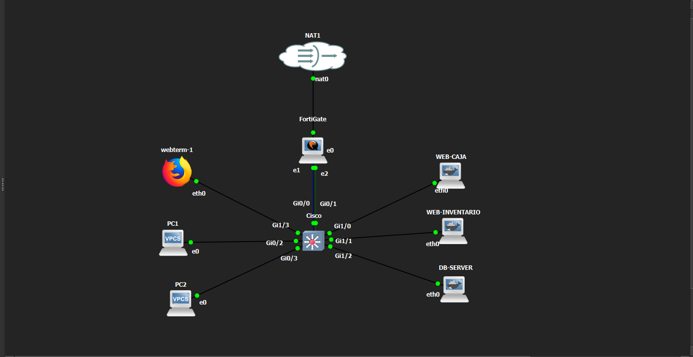

# FortiGate DMZ - Seguridad de Redes

## 🎥 Video demostrativo

(https://itlaedudo.sharepoint.com/:v:/s/Pratica/IQA79HL74qQKQZ5HppOkGJvLAZOXk-hDftQlpjdSpu6Utfo?e=bEfBxx&nav=eyJyZWZlcnJhbEluZm8iOnsicmVmZXJyYWxBcHAiOiJTdHJlYW1XZWJBcHAiLCJyZWZlcnJhbFZpZXciOiJTaGFyZURpYWxvZy1MaW5rIiwicmVmZXJyYWxBcHBQbGF0Zm9ybSI6IldlYiIsInJlZmVycmFsTW9kZSI6InZpZXcifX0%3D)

En el video se mostrará el funcionamiento general de la topología y las principales pruebas realizadas para comprobar que las políticas de seguridad funcionan correctamente.

---

## 📌 Propósito del laboratorio

El objetivo de esta práctica fue crear una infraestructura de red segmentada y segura utilizando FortiGate, VLAN, una zona DMZ y diferentes políticas de acceso.

La idea principal fue separar correctamente la red de usuarios de la red de servidores y controlar qué tipo de comunicación puede existir entre ellas.

También se buscó evitar que los servidores ubicados en la DMZ pudieran comunicarse libremente con la red interna o con Internet. En lugar de darles acceso completo, solo se permitió la comunicación necesaria para las actualizaciones del sistema.

Además, se aplicaron configuraciones básicas de seguridad en el switch para proteger los puertos utilizados por los usuarios y deshabilitar aquellos que no forman parte de la topología.

---

## 🖥️ Topología

La infraestructura utilizada está compuesta por:

- 1 FortiGate
- 1 switch Cisco
- 2 usuarios
- 2 servidores Web
- 1 servidor de Base de Datos
- 1 WebTerm utilizado para la administración
- 1 conexión NAT para representar la salida hacia Internet

Los servidores utilizados fueron:

- **WEB-CAJA**
- **WEB-INVENTARIO**
- **DB-SERVER**

Los usuarios se encuentran separados en:

- **PC1:** VLAN 10
- **PC2:** VLAN 20

### Captura de la topología en GNS3

### Diagrama lógico

---

## 🌐 Direccionamiento IP

### VLAN 10

- Red: `10.12.48.0/25`
- Gateway: `10.12.48.1`
- Asignación de IP: DHCP

### VLAN 20

- Red: `10.12.49.0/25`
- Gateway: `10.12.49.1`
- Asignación de IP: DHCP

### DMZ

- Red: `10.12.48.128/28`
- Gateway: `10.12.48.129`

| Equipo | Dirección IP |
|---|---|
| FortiGate - DMZ | `10.12.48.129` |
| WEB-CAJA | `10.12.48.130` |
| WEB-INVENTARIO | `10.12.48.131` |
| DB-SERVER | `10.12.48.132` |

### Red de administración

- Red: `10.12.50.0/29`
- FortiGate: `10.12.50.1`
- Switch Cisco: `10.12.50.2`
- WebTerm: `10.12.50.3`

---

## 🔥 Configuración del FortiGate

El FortiGate se utilizó como el dispositivo principal de seguridad entre la red interna, la DMZ e Internet.

La configuración principal de seguridad del FortiGate, incluyendo interfaces, objetos, rutas y políticas, fue realizada y verificada desde la interfaz gráfica del equipo.

| Interfaz | Función |
|---|---|
| port1 | Salida hacia Internet |
| port2 | Comunicación con la red interna |
| port3 | Red DMZ |

Las rutas utilizadas fueron:

- `10.12.48.0/25` vía `10.12.50.2`
- `10.12.49.0/25` vía `10.12.50.2`

---

## 🛡️ Políticas de seguridad

### Acceso SSH desde VLAN 20

La VLAN 20 fue configurada como la única red autorizada para acceder por SSH a los servidores.

Servicio permitido:

- TCP 22 / SSH

Se realizaron pruebas hacia:

- WEB-CAJA
- WEB-INVENTARIO
- DB-SERVER

Desde VLAN 20 las conexiones fueron permitidas correctamente.

Desde VLAN 10 las conexiones quedaron bloqueadas.

---

## 🌐 Acceso de VLAN 10 al Sistema de Caja

Los usuarios pertenecientes a VLAN 10 tienen acceso a:

`10.12.48.130`

Servicios permitidos:

- HTTP
- HTTPS

Durante las pruebas se confirmó que el servidor WEB-CAJA es accesible desde PC1.

---

## 🚫 Restricción de VLAN 10 al Sistema de Inventario

El servidor del Sistema de Inventario utiliza la dirección:

`10.12.48.131`

Para impedir el acceso desde VLAN 10 se configuró un perfil de Web Filter en FortiGate que bloquea el acceso a esta dirección.

Durante la prueba se intentó abrir el Sistema de Inventario desde un equipo ubicado en VLAN 10. FortiGate interceptó la solicitud y mostró una página de bloqueo indicando que el acceso no estaba permitido.

De esta forma se comprobó visualmente que VLAN 10 puede acceder al Sistema de Caja, pero tiene restringido el acceso al Sistema de Inventario.

---

## 🌐 Acceso a Internet desde la DMZ

Los servidores ubicados en la DMZ no tienen acceso libre hacia Internet.

Solo se permitieron los destinos necesarios para actualizaciones:

- `archive.ubuntu.com`
- `security.ubuntu.com`

Los servidores pueden ejecutar:

`apt update`

El tráfico hacia otros destinos de Internet queda bloqueado.

---

## 🔒 Aislamiento de la DMZ

Se verificó que los servidores de la DMZ no puedan iniciar conexiones hacia las redes internas.

Pruebas realizadas hacia:

- VLAN 10: `10.12.48.1`
- VLAN 20: `10.12.49.1`

Resultado:

`100% packet loss`

Esto confirma que la DMZ no puede iniciar tráfico hacia la LAN.

---

## 🌐 Servidores Web

### WEB-CAJA

- IP: `10.12.48.130`
- Servicio: Nginx
- Puerto: TCP 80
- Función: Sistema de Caja

### WEB-INVENTARIO

- IP: `10.12.48.131`
- Servicio: Nginx
- Puerto: TCP 80
- Función: Sistema de Inventario

---

## 🗄️ Servidor de Base de Datos

DB-SERVER utiliza MariaDB.

- IP: `10.12.48.132`
- Puerto: TCP 3306
- Servicio: MariaDB

MariaDB fue configurado para escuchar en:

`10.12.48.132:3306`

---

## 🔐 Servicio SSH

OpenSSH fue instalado y habilitado en los tres servidores.

Desde VLAN 20 se confirmó acceso al puerto TCP 22 de:

- WEB-CAJA
- WEB-INVENTARIO
- DB-SERVER

Desde VLAN 10 las conexiones terminaron en timeout.

---

## 🔀 Configuración del Switch

| VLAN | Nombre | Uso |
|---|---|---|
| 10 | USUARIOS_VLAN10 | Usuarios |
| 20 | USUARIOS_VLAN20 | Usuarios con acceso SSH |
| 30 | DMZ_SERVIDORES | Servidores |
| 99 | TRANSITO_MGMT | Administración y tránsito |

Las interfaces VLAN 10, VLAN 20 y VLAN 99 fueron configuradas como interfaces Layer 3.

### DHCP

El switch entrega direcciones IP automáticamente a los usuarios de VLAN 10 y VLAN 20.

Se configuraron pools DHCP independientes para cada red.

---

## 🛡️ Seguridad básica del Switch

### Port-Security

Se configuró:

- Máximo de 2 direcciones MAC
- Sticky MAC
- Modo de violación Shutdown
- PortFast
- BPDU Guard

### Puertos no utilizados

Todos los puertos que no forman parte de la topología fueron apagados administrativamente.

Durante la verificación aparecen como:

`administratively down`

---

## 🧪 Pruebas realizadas

| Prueba | Resultado |
|---|---|
| VLAN 10 → WEB-CAJA HTTP | ✅ Permitido |
| VLAN 10 → WEB-INVENTARIO HTTP | ❌ Bloqueado |
| VLAN 20 → WEB-CAJA SSH | ✅ Permitido |
| VLAN 20 → WEB-INVENTARIO SSH | ✅ Permitido |
| VLAN 20 → DB-SERVER SSH | ✅ Permitido |
| VLAN 10 → servidores por SSH | ❌ Bloqueado |
| DMZ → VLAN 10 | ❌ Bloqueado |
| DMZ → VLAN 20 | ❌ Bloqueado |
| DMZ → repositorios de Ubuntu | ✅ Permitido |
| DMZ → Internet general | ❌ Bloqueado |

---

## 📸 Evidencias

Las capturas se encuentran organizadas dentro de:

`evidencias/`

Entre ellas:

- Interfaces del FortiGate
- Rutas estáticas
- Políticas de firewall
- Objetos de direcciones
- DNS de la DMZ
- VLAN
- DHCP
- Port-Security
- Sticky MAC
- Puertos no utilizados
- Nginx
- SSH
- MariaDB
- Accesos permitidos
- Accesos bloqueados
- Restricciones de la DMZ

---

## 📁 Configuraciones

Los archivos se encuentran dentro de:

`configuraciones/`

Incluyen:

- Running-Config del switch Cisco
- Respaldo de configuración del FortiGate
- Configuraciones documentadas de los servidores

---

## 📜 Scripts

En esta infraestructura no fue necesario crear scripts de automatización independientes.

La mayor parte de la configuración se realizó directamente en el FortiGate, el switch y los servidores.

Los comandos utilizados durante la implementación y las pruebas se encuentran documentados junto con sus evidencias.

---

## ✅ Conclusión

Durante esta práctica se logró implementar una infraestructura de red segmentada donde cada grupo de dispositivos tiene un nivel de acceso diferente según su función.

Los usuarios fueron separados utilizando VLAN, mientras que los servidores fueron colocados dentro de una DMZ protegida por FortiGate.

La VLAN 20 quedó como la única autorizada para utilizar SSH hacia los servidores. VLAN 10 puede acceder al Sistema de Caja, pero tiene restringido el acceso al Sistema de Inventario.

Los servidores de la DMZ tampoco pueden iniciar conexiones hacia la red interna y su acceso a Internet quedó limitado únicamente a los repositorios necesarios para realizar actualizaciones.

Finalmente, se aplicaron medidas básicas de seguridad en el switch para proteger los puertos utilizados y reducir accesos no autorizados.

Con estas configuraciones se logró cumplir con los principales objetivos de seguridad planteados para la infraestructura.
